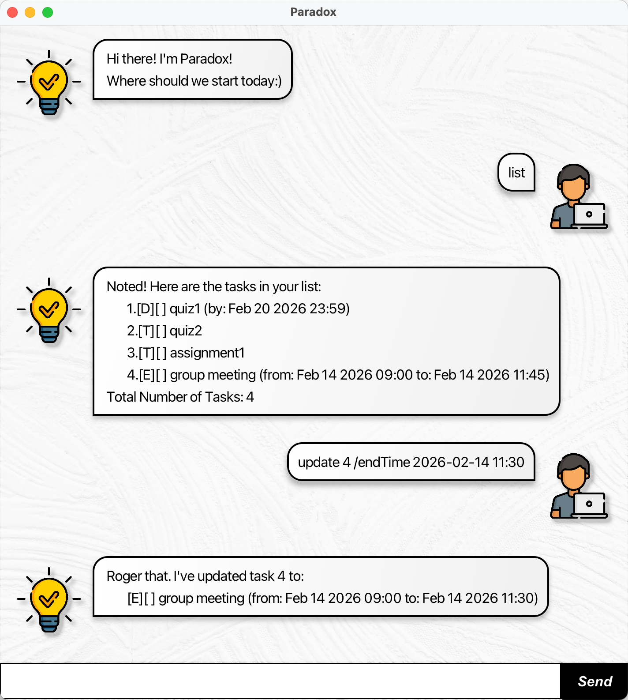

# Paradox User Guide



Paradox is a full-stack Java task management chatbot application that helps you keep track of your todos, deadlines, and events. It features a graphical user interface and persistent storage to ensure your tasks are never lost. Whether you need to manage simple to-do items, time-sensitive deadlines, or scheduled events, Paradox has you covered!

## Features

### Adding a Todo Task: `todo`

Add a simple task without any date or time.

**Format:** `todo <task content>`

**Example:** `todo read book`

**Expected output:**
```
 Copy. I've added this task:
   [T][ ] read book
 Now you have 1 tasks in the list.
```

---

### Adding a Deadline Task: `deadline`

Add a task with a specific deadline date and time.

**Format:** `deadline <task content> /by <yyyy-MM-dd HH:mm>`

**Example:** `deadline submit report /by 2026-03-15 23:59`

**Expected output:**
```
 Copy. I've added this task:
   [D][ ] submit report (by: Mar 15 2026 23:59)
 Now you have 2 tasks in the list.
```

---

### Adding an Event Task: `event`

Add an event with a start and end time.

**Format:** `event <task content> /from <yyyy-MM-dd HH:mm> /to <yyyy-MM-dd HH:mm>`

**Example:** `event team meeting /from 2026-02-20 14:00 /to 2026-02-20 16:00`

**Expected output:**
```
 Copy. I've added this task:
   [E][ ] team meeting (from: Feb 20 2026 14:00 to: Feb 20 2026 16:00)
 Now you have 3 tasks in the list.
```

---

### Listing All Tasks: `list`

View all tasks in your task list.

**Format:** `list`

**Expected output:**
```
 Noted! Here are the tasks in your list:
   1.[T][ ] read book
   2.[D][ ] submit report (by: Mar 15 2026 23:59)
   3.[E][ ] team meeting (from: Feb 20 2026 14:00 to: Feb 20 2026 16:00)
 Total Number of Tasks: 3
```

---

### Marking a Task as Done: `mark`

Mark a task as completed.

**Format:** `mark <task number>`

**Example:** `mark 1`

**Expected output:**
```
 Excellent! I've marked this task as done:
   [T][X] read book
```

---

### Unmarking a Task: `unmark`

Mark a previously completed task as not done.

**Format:** `unmark <task number>`

**Example:** `unmark 1`

**Expected output:**
```
 Alright, I've marked this task as not done yet:
   [T][ ] read book
```

---

### Deleting a Task: `delete`

Remove a task from your list.

**Format:** `delete <task number>`

**Example:** `delete 2`

**Expected output:**
```
 Ay ay! I've removed this task:
   [D][ ] submit report (by: Mar 15 2026 23:59)
 Now you have 2 tasks in the list.
```

---

### Finding Tasks: `find`

Search for tasks containing a specific keyword.

**Format:** `find <keyword>`

**Example:** `find book`

**Expected output:**
```
 Copy that. Here are the matching tasks in your list:
   1.[T][ ] read book
 Total Number of Tasks: 1
```

---

### Updating a Task: `update`

Update the content, deadline, start time, or end time (if applicable) of an existing task.

**Format:** `update <task number> <update details>`

**Update Tags:**
- `/content <new content>` - Update task description
- `/deadline <yyyy-MM-dd HH:mm>` - Update deadline (for deadline tasks)
- `/startTime <yyyy-MM-dd HH:mm>` - Update start time (for event tasks)
- `/endTime <yyyy-MM-dd HH:mm>` - Update end time (for event tasks)

**Example:** `update 1 /content finish reading book`

**Expected output:**
```
 Roger that. I've updated task 1 to:
   [T][ ] finish reading book
```

---

### Exiting the Application: `bye`

Close the application.

**Format:** `bye`

---

## Task Symbols

- `[T]` - Todo task
- `[D]` - Deadline task
- `[E]` - Event task
- `[ ]` - Task not completed
- `[X]` - Task completed

---

## Notes

- All dates and times must follow the format `yyyy-MM-dd HH:mm` (e.g., `2026-03-15 23:59`)
- Task numbers are 1-based (the first task is task 1, not task 0)
- Tasks are automatically saved to `./data/taskList.txt` and will persist between sessions
- The task list has a maximum capacity of 100 tasks
